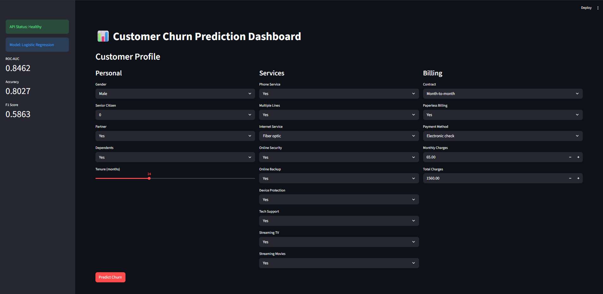

# Customer Churn Prediction

An end-to-end machine learning platform that predicts whether a telecom customer will churn. Built with a production-grade architecture — data pipeline, experiment tracking, REST API, and an interactive dashboard.



---

## Architecture

```
Raw CSV
  ↓
data_processing.py   — cleans data, engineers features
  ↓
train.py             — trains 4 models, tracks experiments with MLflow
  ↓
best_model.pkl       — saved sklearn pipeline
  ↓
FastAPI (api/)       — serves predictions via REST API
  ↓
Streamlit (app/)     — interactive dashboard calling the API
```

---

## Tech stack

| Component | Tool |
|---|---|
| Data processing | Pandas, Scikit-learn |
| Experiment tracking | MLflow |
| Models | Logistic Regression, Random Forest, XGBoost, Gradient Boosting |
| API | FastAPI + Uvicorn |
| Dashboard | Streamlit + Plotly |
| Model persistence | Joblib |

---

## Model performance

Best model: **Logistic Regression**

| Metric | Score |
|---|---|
| ROC-AUC | 0.846 |
| Accuracy | 80.3% |
| F1 Score | 0.586 |

Trained on the [IBM Telco Customer Churn dataset](https://www.kaggle.com/datasets/blastchar/telco-customer-churn) — 7,043 customers, 26.5% churn rate.

---

## Features

- Full ML pipeline from raw data to live predictions
- MLflow experiment tracking — all 4 model runs logged and comparable
- REST API with auto-generated Swagger docs at `/docs`
- Risk classification — Low / Medium / High based on churn probability
- Interactive gauge chart showing churn probability visually
- Engineered features: tenure group, charges per tenure, total services count

---

## Run locally

**1. Clone the repo**
```bash
git clone https://github.com/alihyder3/customer-churn-prediction.git
cd customer-churn-prediction
```

**2. Create virtual environment**
```bash
python -m venv venv
venv\Scripts\activate        # Windows
source venv/bin/activate     # Mac/Linux
```

**3. Install dependencies**
```bash
pip install -r requirements.txt
```

**4. Download the dataset**

Download `WA_Fn-UseC_-Telco-Customer-Churn.csv` from [Kaggle](https://www.kaggle.com/datasets/blastchar/telco-customer-churn) and place it in `data/raw/`.

**5. Run the pipeline**
```bash
cd src
python data_processing.py   # clean and engineer features
python train.py             # train models, log to MLflow
python evaluate.py          # generate evaluation charts
```

**6. Start the API**
```bash
cd api
uvicorn main:app --reload
```

**7. Start the dashboard**
```bash
python -m streamlit run app/dashboard.py
```

API runs at `http://localhost:8000` — interactive docs at `http://localhost:8000/docs`

Dashboard runs at `http://localhost:8501`

---

## API endpoints

| Method | Endpoint | Description |
|---|---|---|
| GET | `/` | API info and model metrics |
| GET | `/health` | Health check |
| POST | `/predict` | Predict churn for a customer |
| GET | `/model-info` | Model metadata and metrics |

**Example request:**
```bash
curl -X POST "http://localhost:8000/predict" \
  -H "Content-Type: application/json" \
  -d '{"tenure": 24, "MonthlyCharges": 85.0, "Contract": "Month-to-month", ...}'
```

**Example response:**
```json
{
  "churn_prediction": 1,
  "churn_probability": 0.7451,
  "risk_level": "High",
  "model_used": "Logistic Regression"
}
```

---

## Project structure

```
customer-churn-prediction/
├── src/
│   ├── data_processing.py   # cleaning + feature engineering
│   ├── train.py             # training pipeline + MLflow logging
│   └── evaluate.py          # metrics, confusion matrix, ROC curve
├── api/
│   └── main.py              # FastAPI REST endpoints
├── app/
│   └── dashboard.py         # Streamlit dashboard
├── data/
│   ├── raw/                 # original dataset
│   └── processed/           # cleaned, feature-engineered data
├── models/                  # saved model + metadata
├── docs/                    # evaluation charts + screenshots
├── mlflow_runs/             # experiment tracking logs
└── requirements.txt
```

---

## View experiment tracking

```bash
mlflow ui --backend-store-uri mlflow_runs
```

Open `http://localhost:5000` to compare all 4 model runs side by side.